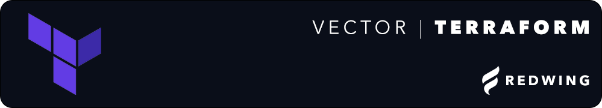

# Vector | Terraform

## Run

To run the app with prompt-based auto-configuration, simply enter the directory where the app is installed and run the following command:

Mac:

```bash
sh run_mac_terraform.sh
```

Linux:

```bash
sh run_unix_terraform.sh
```

## Manual Configuration

To run the app from a manual configuration, **environment variables must be set**. 

Open the terminal and run the following commands:

```bash
export LICENSE_KEY='Your Vector License Key'
export CUSTOMER_ID='Your Vector Customer ID'
```

Be sure to run the app from the same terminal window, or ensure the variables are saved to your .bash_profile or .bashrc

Documentation for getting AWS Access Keys is available here, IAM roles must be configured for correct usage and access to Cloudwatch.
[AWS IAM Documentation](https://docs.aws.amazon.com/powershell/latest/userguide/pstools-appendix-sign-up.html
)

## AWS Credentials Configuration

Before running the application, you need to set up your AWS credentials.

Prerequisites:
Make sure you have the AWS CLI installed. If not, follow these instructions.

Edit the ~/.aws/credentials and/or ~/.aws/config files for boto to run or use the AWS CLI to update.

```bash
[default]
aws_access_key_id = YOUR_ACCESS_KEY_ID
aws_secret_access_key = YOUR_SECRET_ACCESS_KEY
```

Important Notes:
Never commit your ~/.aws/credentials file to source control.
Regularly rotate your AWS access keys and always follow best security practices.
Ensure you have the necessary permissions in AWS to perform the actions required by the application.